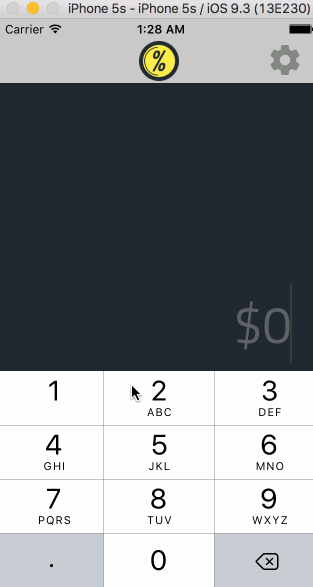
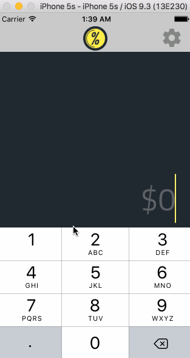

* User can enter a bill amount, choose a tip percentage, and see the tip and total values.
* Settings page to change the default tip percentage.
* Use locale-specific currency
* Light and Dark themes
* Customizable "Mood" choices instead of having set percentage values
* Bill splitting

